# Data-Analyst-Portfolio

### Introduction
As a recent graduate with a Bachelor of Science in Management Information Systems, I am well-prepared to contribute analytical and data-driven insights within an organization focused on strategic decision-making. My academic background, augmented by practical project experience, has equipped me with the skills to collect, analyze, and interpret complex datasets, enabling me to extract actionable insights that support organizational goals.

Throughout my academic and project work, I have developed a portfolio that showcases proficiency in:
- Constructing impactful data visualizations
- Developing predictive and optimization models
- Applying data-driven strategies to enhance business processes and streamline operations

With a commitment to applying these competencies, I am poised to make a meaningful impact by advancing organizational objectives through data-centered solutions.

---

### Contact
- LinkedIn: [LinkedIn Portfolio](https://www.linkedin.com/in/christianaguirre)
- Email: christianaguirrepp@gmail.com

---

### Education
- Bachelors of Science in Management Information Systems, *George Mason University*
  
- Associates of Science in Business Administration, *Northern Virginia Community College*

---

### Work Experience
Pro Sales Associate @ Lowes Inc.

- Sales Data Analysis: Conducted a thorough analysis of sales data to identify high-demand building materials, enabling targeted promotions and inventory adjustments that increased sales by 15%.

- Customer Satisfaction Tracking: Analyzed customer feedback and complaint resolution data, uncovering key service improvements that led to a 20% rise in satisfaction ratings.

---

## Projects

### Project 1: Optimizing Operational Performance in Lawn Equipment Manufacturing

### (Fall 2021, Busniess Analytics II)

**Project Overview:**

This senior-level project, undertaken in the Business Analytics II course, focused on diagnosing and addressing core operational issues within a hypothetical lawn equipment manufacturing company. Key challenges explored included improving on-time delivery rates, reducing transmission costs, and enhancing employee retention, all critical areas impacting operational efficiency and overall company performance. The project aimed to empower operations managers and decision-makers with actionable insights derived from in-depth data analysis and visualization.

**Project Objectives:**

1. Increase On-Time Delivery Rates: Analyze delivery performance from 2014 to 2018 to identify trends and areas for improvement.
   
2. Optimize Transmission Costs: Assess the cost-effectiveness of alternative transmission processes to determine the most efficient approach.
   
3. Enhance Employee Retention: Evaluate factors influencing employee retention, including gender and locality, to inform strategies for improved workforce stability.

**Technical Specifications:**

This project was developed using Microsoft Excel for data analysis and visualization, with Microsoft Word employed for structured reporting. Excel was instrumental in data manipulation, KPI tracking, and generating insights, while Word served to compile findings in a coherent report. The project was executed using Microsoft Office Suite 2016 or later.

**Project Structure:**
Data Analysis Worksheets: Organnized in an Excel file, the worksheets contain Raw data, Calculations, and Graphs. Arranged in labeled tabs for clear navigation. Organized within a comprehensive Excel workbook, the data was segmented into tabs labeled for specific KPIs, including:

  - On-Time Delivery Analysis: Examined monthly on-time delivery performance between 2014 and 2018, highlighting improvements and seasonal trends to inform operational adjustments.

  

  - Transmission Cost Analysis: Compared the cost-effectiveness of current versus alternative transmission processes to identify potential savings and efficiency improvements.

  

  - Employee Retention Analysis: Analyzed retention trends by gender and local/non-local status to uncover patterns that could inform targeted retention strategies.

  
 
Each worksheet features formatted cells, data filters, and conditional formatting to support clear data exploration and real-time updates to visualizations.

- Comprehensive Report: An 8-page Microsoft Word report provided a structured presentation of insights, including:
  
    - Executive Summary: Overview of objectives, methods, and key findings.
    
    - Detailed Analysis: Section-by-section analysis for each KPI.
    
    - Data Visual Summaries: Visual representations of key insights to enhance clarity and impact.
 
**Methodology and Analysis:**

  -- On-Time Delivery Analysis: A one-sample proportion test was performed to evaluate whether delivery rates in 2018 improved significantly over 2014, with results indicating a notable increase in on-time deliveries.
  
  
    
  -- Transmission Cost Evaluation: Using a one-way ANOVA test, the project analyzed cost variances across different transmission processes. The findings indicated marginal cost differences, suggesting that current processes might remain viable with minor adjustments.
  
  
    
  -- Employee Retention Assessment: Employee retention data revealed slight variations based on gender and locality, with local employees and male employees demonstrating marginally higher retention rates
  
  

**Usage Instructions:**
1. Setup
   - Ensure access to Microsoft Excel and Word (version 2016 or later).
     
2. Exploring the Analysis
   - Open the Excel workbook to review and interact with data visualizations and metrics.
     
   - Each worksheet tab corresponds to specific KPIs, allowing stakeholders to focus on areas of interest.
     
3. Testing and Debugging
   - Filters within Excel were tested for data consistency.
     
   - All calculations are designed to dynamically update based on input adjustments.

**Deliverables:**

  - Improvement in On-Time Delivery: Evidence showed a consistent increase in delivery performance from 2014 to 2018.
    
  - Transmission Process Optimization: Process A was identified as a potential, albeit minimally more cost-effective, alternative to the current transmission process.
    
  - Enhanced Retention Insights: Data-driven suggestions were made to improve employee satisfaction and retention, factoring in demographic influences.

**Conclusion**

This project demonstrates the value of data analytics in supporting data-driven decision-making. The insights provided serve as a foundation for improved operational efficiency and employee retention strategies, giving the company practical guidance for sustained performance optimization. The final report and Excel worksheets are designed to be user-friendly resources, offering clear directions for applying the findings and monitoring progress.

**Contribution and Licensing**

As a university project, this work is proprietary and intended for educational use within the scope of the course requirements.

**Future Work and Feedback**

To enhance functionality and align the database with real-world business needs, several expansions are proposed:

- Predictive Modeling Integration: Implementing machine learning models to forecast trends, such as seasonal demand and service profitability, to enable proactive decision-making.
  
- Automated KPI Tracking: Automating the tracking of key performance indicators to streamline monitoring and improve response times to business shifts.
  
- ERP System Integration: Embedding the database within an ERP framework would provide real-time insights across business functions, enhancing visibility and data accessibility for continuous operational improvement.

Feedback from stakeholders and industry professionals is highly valued. Their insights will be critical in refining and adapting the project for practical applications, ensuring that it meets the evolving demands of the industry and provides maximum value to end-users.

---

### Project 2: Application of Operations Management Techniques in Resource Optimization and Decision-Making

### (Fall 2023, Operations and Supply Chain Management)

**Project Overview:**
This project applies advanced management science techniques to solve six real-world operational challenges. Using mathematical optimization methods such as Linear Programming (LP), Mixed-Integer Linear Programming (MILP), and Binary Integer Linear Programming (BILP), it emphasizes resource allocation, cost reduction, and efficiency improvement. By integrating decision-making tools like decision trees and simulation, the project highlights practical applications across supply chain, retail, and manufacturing environments.

**Problems and Solutions**

Problem A: Customer Checkout Optimization

Objective: Reduce customer balking by optimizing cashier allocation using queueing theory models.

Methodology:

  1. Modeling Customer Behavior: Customer arrivals were modeled as a Poisson process, while service times were assumed to follow an exponential distribution.

     
     
  2. Queueing System Analysis: Utilization factors were calculated for 1, 2, and 3 cashiers to determine system viability and performance.

     
     
  3. Optimization Criteria: The probability of a customer waiting more than 5 minutes was evaluated to meet operational objectives.

     

Results: Our analysis revealed that a minimum of three cashiers working collaboratively is necessary to meet operational goals and minimize customer balking. This optimized staffing level significantly reduces wait times and enhances overall customer satisfaction.

---

Problem B: Specialty Steak Stocking

Objective: Determine the optimal weekly stocking level for steaks to maximize profitability.

Methodology: 
1. Payoff Table and Regret Table: These tables provide a clear view of profits and regrets for different stocking decisions under all possible demand scenarios.

   
   
2. Decision Criteria:
   
   - Expected Value Criterion: Chooses the option with the highest average expected payoff.
     
     
     
   - Optimistic Criterion: Assumes the best-case scenario for each decision.
  
     
     
   - Pessimistic Criterion: Focuses on minimizing potential losses (worst-case scenario).

     

4. Sensitivity Analysis: Ensures that the chosen decision remains optimal under demand fluctuations.

Results: The analysis indicated that an optimal weekly order quantity of 35 pounds maximizes expected weekly profit at $79. This decision is based on the expected value criterion and is supported by sensitivity analysis, which confirmed its robustness under various demand scenarios.

---

Problem C: Profitability of a New Product

Objective: Simulate profitability under varying cost scenarios.

Methodology: A Monte Carlo simulation was conducted with 20 random trials to account for uncertainty in key cost variables: unit cost, fixed cost, and selling price. For each trial, the profit per unit was calculated, considering a fixed demand of 1000 units. The mean profit per unit, standard deviation, and 95% confidence interval were determined from the simulation results.

A Monte Carlo simulation was run with 20 random trials for purchase cost, labor cost, and transportation cost. Profit per unit was calculated using:

- Profit per unit was calculated using: Profit = Selling Price − Purchase Cost − Labor Cost − Transportation Cost

Results: The mean profit per unit was estimated to be $6.90, with a standard deviation of $2.27. The 95% confidence interval for the mean profit per unit was between $4.46 and $9.34. Based on these findings, the new product has the potential to meet profitability criteria and is recommended for launch, subject to further analysis and risk assessment.

---

Problem D: Copier Selection for a Law Office

Objective: Evaluate costs and operational efficiency of two copier options for a law office.

Methodology: We calculated the hourly costs associated with leasing each copier option and employee wages for operation. Linear Programming (LP) was then employed to compare the total costs across various scenarios, considering factors such as print volume, speed, and maintenance requirements.

Results: After a comprehensive analysis, the high-speed copier emerged as the most cost-effective option. This selection resulted in a daily cost savings of $11.20 compared to the regular copier. This significant cost reduction can be attributed to the high-speed copier's increased efficiency and reduced operational time.

---

Problem E: Patent Infringement Lawsuit Decision

Objective: Decide between settling or going to trial in a patent dispute.

Methodology: A decision tree analysis was conducted to evaluate the expected monetary value (EMV) of each option. This involved estimating the probabilities and costs associated with various outcomes, including:

- Settlement: The potential costs of a settlement, including legal fees and licensing fees.

- Trial: The potential costs of a trial, including legal fees, expert witness fees, and potential damages.

  

Results: After careful analysis of the decision tree, it was determined that proceeding to trial yielded a higher EMV ($1.8 million) compared to settling ($1.5 million). Therefore, based on the expected financial outcomes, it is recommended to proceed with the lawsuit.

---

Problem F: Machine Assignment for Aircraft Part Manufacturing

Objective: Assign machinists to machines to minimize production time.

Methodology: A Binary Integer Linear Programming (BILP) model was developed to assign machinists to four machines—metal lathe, turning machine, milling machine, and radial drill. The model accounts for machinist skill levels and certifications, with the restriction that Machinist 3 cannot be assigned to the turning machine. The goal was to minimize the total production time, given the operating times for each machinist on each machine

Formulated as such:

Results: 

The optimal machinist-machine assignments are as follows:

- Machinist 3 assigned to Metal Lathe
- Machinist 1 assigned to Turning Machine
- Machinist 2 assigned to Milling Machine
- Machinist 4 assigned to Radial Drill

The total combined time to produce a part using all four machines with the assigned operators is 100 minutes.

LINGO INPUT:

LINGO OUTPUT:

---

**Usage Instructions:**

System Requirements:

- Software: Excel with Solver Add-In, LINGO

- Hardware: Standard computer capable of running Excel and LINGO

**Installation and Running Instructions:**

File Setup:

  1. Download provided Excel and LINGO files.
     
  2. Review accompanying documentation for module-specific instructions.

Module Configuration:

- Adjust parameters as needed for business-specific data inputs.

- Ensure solver settings are aligned with project constraints.
  
Execution:

- Excel Solver: Run optimization models directly from the Data Analysis tab.

- LINGO: Execute provided scripts, adjusting parameters for enhanced customization.

Results Verification:

- Cross-check outputs with expected results.
  
- Perform sensitivity analysis to validate robustness.

**Testing and Debugging:**

To ensure solution robustness and adaptability, the following testing and debugging processes were employed:

1. Parameter Adjustment and Constraint Validation:
   
   - Refined constraints to assess model flexibility.
     
2. Sensitivity Analysis:

   - Evaluated variable changes for stability.

3. Iterative Testing:

   - Conducted iterative trials to ensure accuracy.

These methods collectively strengthened the solution’s adaptability and ensured reliable, accurate outputs in diverse business contexts.

**Contribution Guidelines:**

- Code of Conduct: Uphold respectful, clear, and collaborative communication in all interactions. Ensure an inclusive environment that values contributions from all team members and fosters constructive feedback.

- Workflow: Follow the fork-and-pull model for code submissions, allowing contributors to work independently on improvements and new features. Submit pull requests for review and testing to ensure code integrity and compatibility with the main project.

- Style Guide: Maintain a structured, readable format for all scripts and formulas. For LINGO scripts and Excel formulas, adhere to consistent naming conventions, logical indentation, and documentation of complex logic to enhance readability and ease of maintenance.

**Contribution and Licensing:**
As a university project, this work is proprietary and intended for educational use within the scope of the course requirements.

**Future Work and Feedback:**

Proposed Enhancements:
- Integrate machine learning for predictive analytics.
  
- Automate decision-making processes for resource optimization.
  
- Develop real-time data integration for continuous monitoring

Feedback:

Industry expert contributions are encouraged to expand scope and applicability.

---

### Project 3: Landscape Database Revitalization for Enhanced Business Insights 

### (Spring 2023, Advanced Database Management)

**Project Overview:**
This project tackled the restructuring of a fragmented landscaping company's database, transforming it into a streamlined system that supports data integrity and informed decision-making. Using SQL Server Management Studio, SQL Server, and ERDPlus, the project standardized data, eliminated redundancies, and optimized database performance. Over 30 advanced SQL queries were developed to generate key insights on popular services, customer trends, and project profitability. Intended for stakeholders in database management and business operations, this revitalized database provides a reliable foundation for strategic growth.

**Technical Specifications:**

Software Used: SQL Server Management Studio, SQL Server, ERDPlus

**Techniques Applied:**

- Data Standardization and Normalization:

  Applied data standardization and normalization techniques to ensure consistency and accuracy across the database. This process involved transforming inconsistent data into standardized formats and organizing it into structured tables, enhancing data integrity, reducing redundancy, and optimizing performance for efficient querying and management.

- Advanced SQL Queries for Business Insights and Reporting:
  
  Developed over 30 advanced SQL queries to extract key business insights, including customer trends, service popularity, and project profitability. These queries utilized complex SQL functions—such as joins, subqueries, and aggregations—to generate actionable reports that support data-driven decision-making and strategic business growth.

**Project Components and Methodology:**

Project Structure:

1. Data Standardization Module
   
   - Objective: Standardize and normalize fragmented data for consistency across the database.
     
   - Methodology: Design and implement a normalized schema in SQL Server.

2. Redundancy Elimination Module
   
   - Objective: Prevent duplicate data entries and maintain high data integrity.
     
   - Methodology: Use primary/foreign keys and indexing techniques to eliminate redundancies.

3. Business Insights Module
   
   - Objective: Unlock key business insights through SQL queries.
     
   - Methodology: Use over 30 advanced SQL queries to generate insights related to customer behavior, service popularity, and project profitability.

**Database Design and Implementation: ER Model, SQL Scripting, and Query Development**

Task 1: ER Model Development
The goal of this task was to create an Entity-Relationship (ER) model to represent the data relationships within the landscaping business. Key steps included:

  - Identifying Entities: Key entities such as Client, Project, Material, Labor, and Supplier were identified.
    
  - Defining Attributes: Relevant attributes for each entity were defined to capture necessary information.
    
  - Establishing Relationships: Relationships between entities were defined with appropriate cardinality constraints (one-to-one, one-to-many, and many-to-many).
    
  - Refining the ER Model: The model was refined to ensure it met business requirements and enabled efficient data retrieval.

    Original ER Design:
    
    

Task 2: SQL Scripting
This task involved setting up the database and populating it with sample data:

  - Database Creation: A new database, NBDDB-[CTF], was created and set as the default. If an existing database was present, it was dropped.
    
  - Table Creation: Tables were created for entities like Client, Project, Material, Labor, and Supplier, with appropriate data types assigned to each column.
    
  - Defining Constraints:
    
      - Primary keys were added to ensure each record was unique.
        
      - Foreign keys were used to establish relationships between related tables.
        
      - Unique constraints were applied to prevent duplicate entries.
        
      - Data Insertion: At least five records were inserted into each table to facilitate testing and querying.
        
Task 3: Database Querying
The final task involved writing SQL queries to extract valuable insights:

  - Query Development: SQL queries were written to replicate the results from IMS-2 and IMS-3.
    
  - Metrics Analysis: Queries focused on key business metrics such as customer trends, service popularity, and project profitability.
    
  - SQL Functions and Techniques: Functions, aggregations, and joins were used to manipulate and analyze the data, demonstrating the database’s ability to support data-driven decision-making.

**Usage Instructions:**

System Requirements:

Software: SQL Server Management Studio, SQL Server

Hardware: Standard workstation capable of running SQL Server

**Installation and Running Instructions:**

1. Import SQL Scripts:
   
   - Begin by importing the provided SQL scripts into SQL Server Management Studio (SSMS). This step ensures that all necessary database structures and configurations are established prior to execution.

2. Execute Setup Scripts:
   
   - Run the setup scripts to initialize the database schema. These scripts will standardize the data format, normalize tables, and establish relationships between entities. This step is essential for ensuring data integrity and consistency across the system.

3. Generate Business Insights:
   
   - After completing the schema setup, execute the SQL queries provided in the documentation. These queries are designed to extract key business insights, such as customer trends, service popularity, and project profitability. Running these queries will provide actionable data, empowering stakeholders to make informed, data-driven decisions.'
     
Additional Considerations:

   - Database Configuration: Ensure that the database is configured to optimize performance, including indexing, query optimization, and data integrity checks.
   
   - Security: Implement appropriate access controls and authentication mechanisms to protect sensitive business data during the setup and execution process.
   
   - Environment Requirements: Verify that the environment meets the necessary hardware and software specifications for smooth operation, including sufficient memory and processing power for large-scale data queries.

By following these instructions, users will be able to install and execute the system, yielding comprehensive insights to support strategic decision-making processes within the organization.

**Testing and Debugging:**

To ensure the robustness and reliability of the system, comprehensive testing and debugging procedures were followed:

- Parameter Modification for Query Adaptability:
  
  The queries were tested under different scenarios by modifying parameters to assess their adaptability to varying datasets. This ensured that the system could handle a wide range of input conditions and return accurate results without performance degradation.

- Data Consistency Verification:
  
  A rigorous process was implemented to verify the consistency of the data throughout the system. This involved cross-referencing results across multiple modules, ensuring that standardized data was maintained without discrepancies, and validating that the removal of redundancies was successfully implemented.

- Accuracy of Query Results:

  Each SQL query was carefully examined for correctness and precision in its output. Any inconsistencies or unexpected results were promptly identified, debugged, and refined to guarantee that the data returned matched the expected outcomes based on business requirements. Testing was performed using both sample data and live data scenarios to confirm the accuracy of the results in real-world applications.

These steps ensured that the database system operates efficiently, with high data integrity and accurate decision-making insights.

**Contribution Guidelines:**

- Code of Conduct: All contributors are expected to foster a professional, respectful, and collaborative environment. Open and transparent communication is encouraged to ensure that everyone’s input is valued. Discriminatory behavior or disrespectful interactions will not be tolerated. Collaboration should focus on constructive problem-solving and knowledge sharing.

- Workflow: Contributors are encouraged to adhere to a structured development process, following a fork-and-pull model. This ensures that changes are properly reviewed before integration into the main codebase. Each contribution should be made through a separate branch to maintain clear version control, allowing for efficient tracking and resolution of issues.

- Style Guide: To maintain consistency, readability, and best practices, contributors should adhere to a standardized SQL script formatting guide. This includes:

Consistent indentation and alignment for readability.
- Clear and descriptive naming conventions for tables, fields, and queries.
- Commenting and documentation of complex or non-intuitive code.
- Adherence to SQL best practices to ensure performance and security.
- By following these guidelines, we ensure high-quality code and efficient project collaboration, supporting the long-term success and scalability of the project.

**Contribution and Licensing:**

As a university project, this work is proprietary and intended for educational use within the scope of course requirements.

**Future Work and Feedback:**

To further enhance the system's functionality and adaptability, several opportunities for improvement have been identified. These include:

- Integration of Real-Time Data Updates: Implementing real-time data synchronization to ensure that the system always reflects the latest business developments, thereby increasing its relevance and timeliness for decision-making.

- Automation of Report Generation: Introducing automated reporting mechanisms that generate and distribute customized reports on demand, saving time and reducing human error in the reporting process.

- Expansion of Query Capabilities: Extending the current query framework to include additional business metrics such as customer satisfaction, seasonal service demand, and financial projections, offering more comprehensive insights to stakeholders.

These enhancements will contribute to a more robust and flexible system, better suited to meet evolving business needs. Feedback and contributions are highly encouraged as part of a collaborative effort to refine and expand the system's capabilities, ensuring its long-term value and scalability.

---

### Project 4: World Layoffs Data Cleaning for Enhanced Business Analysis

### (January 2025, Database Management Practice)

**Project Overview:**
This project focused on cleaning a real-world dataset on layoffs across industries and countries to ensure its suitability for advanced exploratory data analysis and business insights. Using MySQL, the project involved identifying and resolving duplicates, standardizing inconsistent data, handling missing values, and optimizing the table structure for efficient querying. The final cleaned dataset provided a solid foundation for extracting actionable insights into global layoffs trends.

**Technical Specifications:**

Software Used: GitHub and MySQL

**Techniques Applied:**

- Duplicate Removal: Utilized ROW_NUMBER() with PARTITION BY to identify and eliminate duplicate rows effectively. This ensured that the dataset contained only unique and relevant records.

- Data Standardization: Resolved inconsistencies in textual fields (e.g., industry, country, company) using functions like TRIM() and updates to ensure data consistency and accurate categorization.

- Handling Null and Blank Values: Addressed missing values through logical population where possible (e.g., filling missing industry values by referencing the same company in other rows) or removing irrelevant records where both total_laid_off and percentage_laid_off were NULL.

- Data Type Conversion: Converted date fields from TEXT to DATE format using STR_TO_DATE() and updated column types for compatibility with time-series analysis.

**Project Components and Methodology:**

**Project Structure:**

Raw Data Import Module - 
   
Objective: Create a raw data reference table for all transformations.
    
Methodology: Imported the CSV dataset into a MySQL database (world_layoffs) and created a layoffs table for raw data. This table was retained unchanged to ensure integrity and serve as a baseline for comparison.

Screenshot: The raw data structure of the dataset as imported from the original Excel CSV file.
    
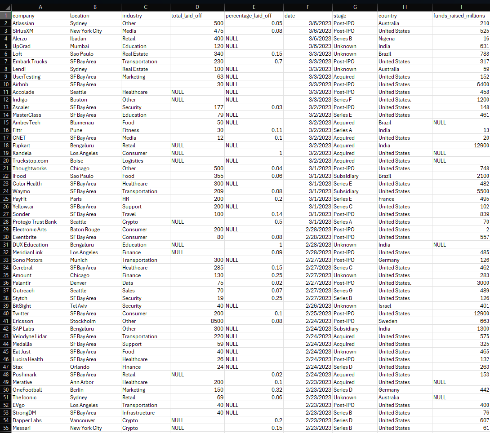

View the raw [Layoffs Data CSV](https://caguirre1378.github.io/Data-Analyst-Portfolio/assets/layoffs.csv) or the [GitHub Table Preview](https://github.com/caguirre1378/Data-Analyst-Portfolio/blob/main/assets/layoffs.csv).

Screenshot: The initial imported layoffs table into MySQL, highlighting the raw data structure after migration from Excel CSV.

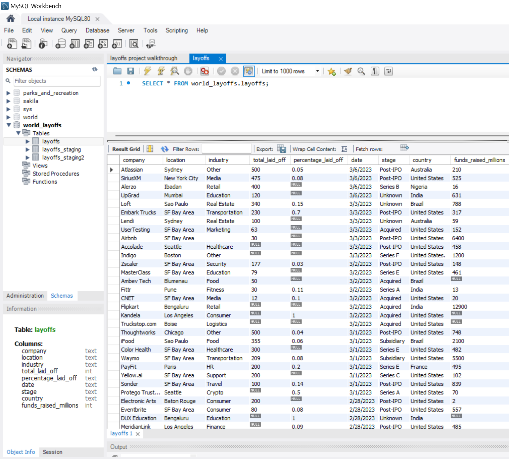

Staging and Cleaning Module - 

Objective: Perform data cleaning and preparation in a controlled environment.
    
Methodology: 
    
- Duplicated the raw data into a layoffs_staging table for intermediate transformations.
  
<pre><code class="language-sql">
CREATE TABLE layoffs_staging LIKE layoffs;

SELECT * FROM layoffs_staging;

INSERT INTO layoffs_staging SELECT * FROM layoffs;
</code></pre>

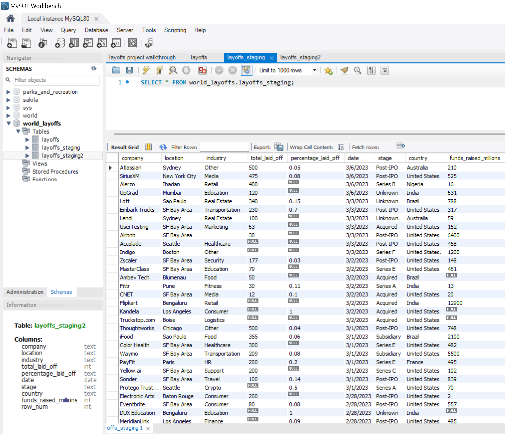

- Created a final table (layoffs_staging2) for cleaned data after all transformations.

<pre><code class="language-sql">
  -- Create a new table to duplicate the raw data structure
CREATE TABLE `layoffs_staging2` (
  `company` text,
  `location` text,
  `industry` text,
  `total_laid_off` int DEFAULT NULL,
  `percentage_laid_off` text,
  `date` text,
  `stage` text,
  `country` text,
  `funds_raised_millions` int DEFAULT NULL
) ENGINE=InnoDB DEFAULT CHARSET=utf8mb4 COLLATE=utf8mb4_0900_ai_ci;

-- Insert raw data into the duplicated table
INSERT INTO layoffs_staging2
SELECT *
FROM layoffs_staging;
</code></pre>

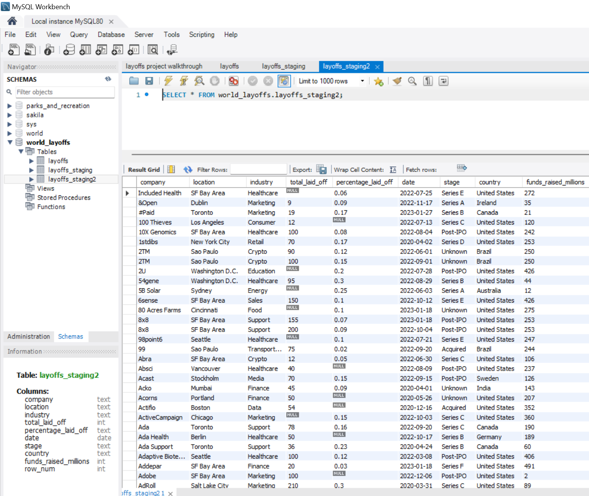

**Cleaning Process:**

Step 1: Removing Duplicates

- Created a ROW_NUMBER() function partitioned by key fields (company, location, industry, date, etc.) to identify duplicates.

- Inserted the result into layoffs_staging2 and removed rows where ROW_NUMBER > 1.

Include Screenshot: Show the query and results of duplicates identified and the cleaned dataset without duplicates.

<pre><code class="language-sql">
-- Step 1: Removing Duplicates

-- Identify duplicates using ROW_NUMBER() and partition by key fields
WITH duplicate_cte AS
(
    SELECT *,
        ROW_NUMBER() OVER (
            PARTITION BY company, location, industry, total_laid_off, percentage_laid_off, `date`, stage, country, funds_raised_millions
        ) AS row_num
    FROM layoffs_staging
)
SELECT *
FROM duplicate_cte
WHERE row_num > 1;

-- Insert data into layoffs_staging2 including the ROW_NUMBER()
INSERT INTO layoffs_staging2
SELECT *,
    ROW_NUMBER() OVER (
        PARTITION BY company, location, industry, total_laid_off, percentage_laid_off, `date`, stage, country, funds_raised_millions
    ) AS row_num
FROM layoffs_staging;

-- Remove rows where ROW_NUMBER > 1 (duplicates)
DELETE 
FROM layoffs_staging2
WHERE row_num > 1;

-- Verify the cleaned dataset
SELECT *
FROM layoffs_staging2;
        </code></pre>

Step 2: Standardizing Data

- Standardized company names using TRIM() to remove whitespace.

- Consolidated variations of industries (e.g., "Cryptocurrency" and "Crypto") into a single category.

- Removed inconsistent formatting in the country field (e.g., "United States." to "United States") using TRIM(TRAILING '.').

Include Screenshot: Display before-and-after views of columns like industry and country to demonstrate data standardization.

<pre><code class="language-sql">
-- Standardize company names by trimming leading and trailing whitespace
UPDATE layoffs_staging2
SET company = TRIM(company);

-- Consolidate variations of industries into a single category
UPDATE layoffs_staging2
SET industry = 'Crypto'
WHERE industry LIKE 'Crypto%';

-- Remove inconsistent formatting in the country field (e.g., "United States." to "United States")
UPDATE layoffs_staging2
SET country = TRIM(TRAILING '.' FROM country)
WHERE country LIKE 'United States%';
        </code></pre>

        

Step 3: Handling Missing Data

- Populated missing industry fields by self-joining on company and location.

- Removed rows where total_laid_off and percentage_laid_off were both NULL, as they provided no meaningful information.

Include Screenshot: Show queries identifying null values and the updated dataset after addressing these issues.

<pre><code class="language-sql">
-- Populate missing industry fields by self-joining on company and location
UPDATE layoffs_staging2 t1
JOIN layoffs_staging2 t2
  ON t1.company = t2.company
  AND t1.location = t2.location
SET t1.industry = t2.industry
WHERE t1.industry IS NULL
  AND t2.industry IS NOT NULL;

-- Remove rows where both total_laid_off and percentage_laid_off are NULL
DELETE
FROM layoffs_staging2
WHERE total_laid_off IS NULL
  AND percentage_laid_off IS NULL;
        </code></pre>

        

Step 4: Data Type Conversion

- Converted date column from TEXT to DATE format using STR_TO_DATE() with the format %m/%d/%Y.

- Modified the date column type in layoffs_staging2 using ALTER TABLE.

Include Screenshot: Highlight the column type transformation and the updated date formatting.

  <pre><code class="language-sql">
-- Convert the date column from TEXT to DATE format
UPDATE layoffs_staging2
SET `date` = STR_TO_DATE(`date`, '%m/%d/%Y');

-- Modify the date column type to DATE
ALTER TABLE layoffs_staging2
MODIFY COLUMN `date` DATE;
        </code></pre>

        

Step 5: Final Cleanup

- Dropped unnecessary columns (e.g., row_num) and verified the integrity of the final table.
  
Include Screenshot: Present the final cleaned table with all columns and data ready for analysis.

<pre><code class="language-sql">
-- Drop the unnecessary row_num column from the table
ALTER TABLE layoffs_staging2
DROP COLUMN row_num;

-- Verify the final cleaned table
SELECT *
FROM layoffs_staging2;
        </code></pre>

        
**Usage Instructions**

System Requirements:

- Software: MySQL (with a GUI tool like MySQL Workbench)

- Hardware: Standard workstation capable of running MySQL.

Installation and Running Instructions:

1. Setup:

- Import the provided raw data CSV file into a MySQL database.

- Execute the SQL scripts for creating staging tables and cleaning transformations.

2 Querying the Data:

- Use the cleaned layoffs_staging2 table for analysis.
  
- Execute additional SQL queries to uncover insights like industry trends, geographical layoff patterns, and funding correlations.

**Testing and Debugging:**

- Verified query correctness by comparing results across raw, staging, and cleaned tables.

- Conducted tests for edge cases, such as blank or null values, ensuring appropriate handling.

- Ensured all transformations adhered to project requirements without data loss.

**Contribution and Licensing:**

This project was developed for educational purposes and showcases advanced SQL data cleaning techniques.

Future Enhancements and Feedback:

1. Integrate Real-Time Updates: Add functionality to handle live updates in the dataset.
   
2. Automate Cleaning Pipelines: Build automated scripts for repetitive cleaning tasks.
   
3. Visualization and Reporting: Integrate the cleaned dataset with visualization tools like Tableau or Power BI for enhanced reporting.

---

### Project 5: Cyclistic Bike-Share Behavior Analysis for Membership Growth

### (May 2026, Google Data Analytics Capstone Project - Case Study #1)

**Project Overview:**
This project focused on uncovering usage trends between casual riders and annual members within the Cyclistic bike-share program in Chicago. As part of the Google Data Analytics Professional Certificate, this capstone project applied the full data analysis process — Ask, Prepare, Process, Analyze, Share, and Act — to inform a strategic marketing campaign aimed at increasing membership conversion. The analysis used 12 months of public trip data to extract actionable insights on ride duration, user behavior, and peak usage patterns.

**Project Objectives:**
1. Identify behavioral differences between casual riders and annual members.
2. Determine peak usage times, ride durations, and ride frequency for both groups.
3. Support a targeted marketing strategy based on user patterns.

**Technical Specifications:**
Tools Used: R (RStudio), ggplot2, dplyr, lubridate, GitHub
Dataset: 12 months of public trip data from Divvy Bike Share (Motivate International Inc.)

<pre><code class="language-r">
install.packages(c(
  "tidyverse",
  "lubridate",
  "janitor",
  "ggplot2",
  "readr"
))
</code></pre>

  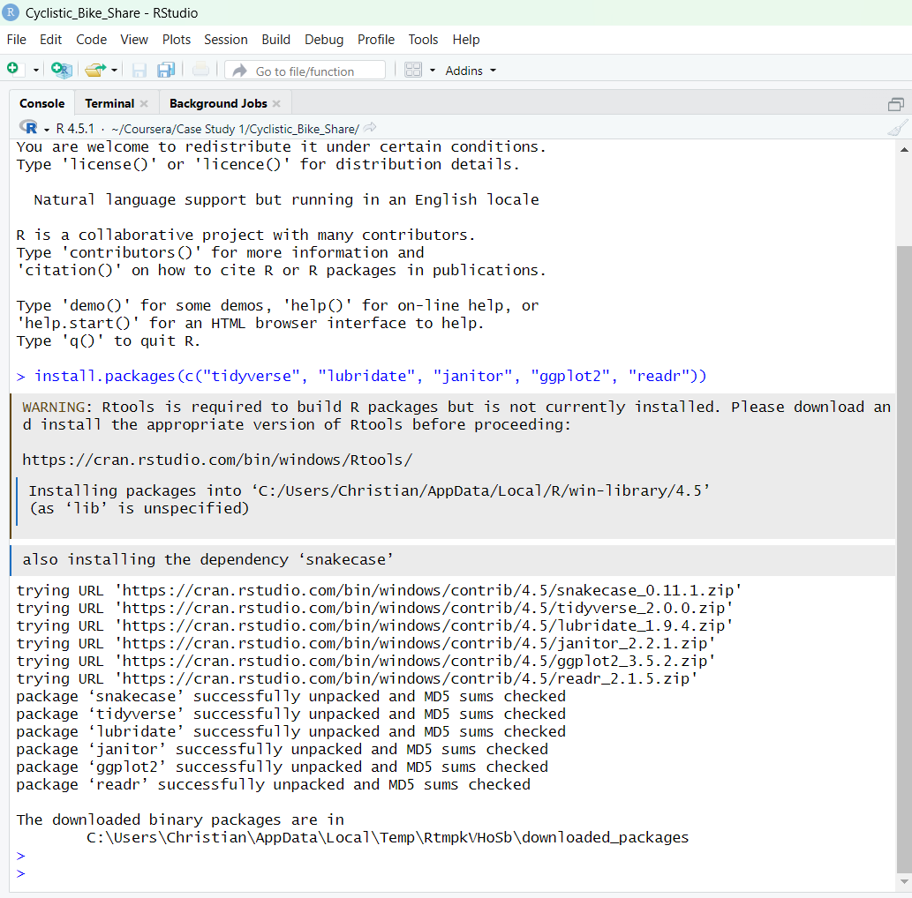
  - Figure 1 – Required R packages installed successfully in RStudio.

**Project Structure:**

1. Data Import and Preparation: The analysis began by downloading and unzipping 12 monthly .csv trip files. These were imported using read_csv() and combined into a single R dataframe via bind_rows(). Column names were standardized across all datasets (e.g., ride_id, rideable_type, started_at, ended_at, member_casual) to ensure uniformity.

      <pre><code class="language-r">
      library(tidyverse)
      library(lubridate)
      library(janitor)
      
      file_list <- list.files("data_raw", pattern = "*.csv", full.names = TRUE)
      
      all_trips <- file_list %>%
        map_df(read_csv) %>%
        clean_names()
      </code></pre>

      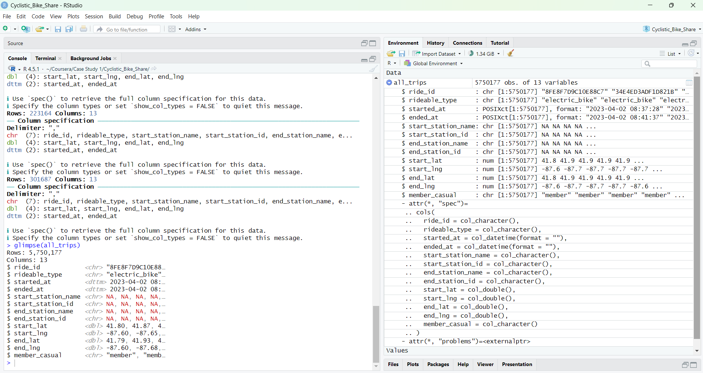
      - Figure 2 – Successful import and merging of 12 monthly datasets into all_trips.

2. Cleaning and Transformation Module: Data cleaning involved removing rides with negative or zero duration and excluding records with missing member_casual values or station IDs. Time-related fields were processed using the lubridate package. Two new variables were created:
    - ride_length, calculated as the difference between ended_at and started_at
    - day_of_week, derived from the started_at timestamp

      <pre><code class="language-r">
      all_trips &lt;- all_trips %&gt;%
        mutate(
          started_at = ymd_hms(started_at),
          ended_at = ymd_hms(ended_at),
          ride_length = as.numeric(difftime(ended_at, started_at, units = "mins")),
          day_of_week = wday(started_at, label = TRUE)
        ) %&gt;%
        filter(ride_length &gt; 1, !is.na(member_casual)) %&gt;%
        drop_na()
      </code></pre>
      
      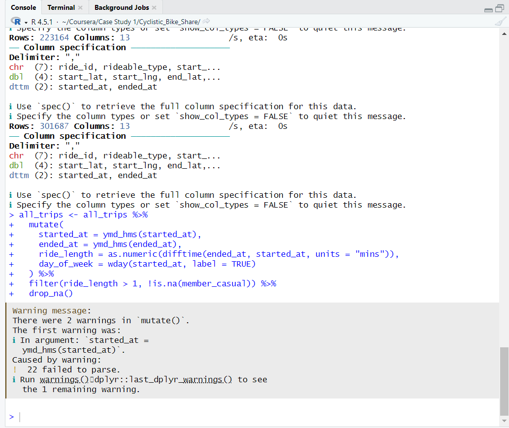
      - Figure 3 – ride_length and day_of_week calculated with cleaned dataset.

3. Analysis Module: Using dplyr, the data was grouped by user type and weekday to calculate summary metrics such as mean ride length, total duration by user type, and ride frequency across weekdays. Pivot-style summaries and cross-tabulations were developed to uncover usage patterns.

      <pre><code class="language-r">
      summary_stats &lt;- all_trips %&gt;%
        group_by(member_casual) %&gt;%
        summarise(
          average_ride_length = mean(ride_length),
          median_ride_length = median(ride_length),
          max_ride_length = max(ride_length),
          min_ride_length = min(ride_length),
          ride_count = n()
        )
      
      print(summary_stats)
      </code></pre>

      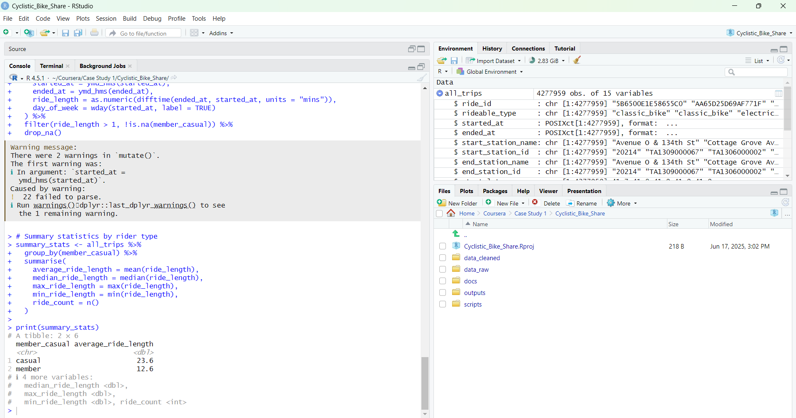
      - Figure 4 – Summary statistics showing longer ride durations for casual riders.

4. Visualization and Communication: Visual analysis was conducted using ggplot2 and Tableau. The following charts were produced to support interpretation:
    - Bar charts showing ride volume by user type and weekday
    - Line charts illustrating average ride duration over time
    - Heatmaps identifying peak usage by hour and day
    - Example visuals were included to communicate trends to stakeholders ->

**Usage Instructions:**

System Requirements:
  -   Software: R (RStudio), Excel or Sheets (optional), Tableau
  -   Hardware: Workstation capable of handling ~1M rows

Setup Instructions:
1. Download 12 monthly Divvy datasets from Divvy Data Portal
2. Run cyclistic_cleaning_and_analysis.R to:
  - Merge and clean the data
  - Export summaries
3. Open Tableau dashboards or .Rmd report for visual insights

**Insights:**
1. Ride Volume by Weekday:
   - Casual usage peaks on Saturdays and Sundays, reflecting recreational behavior.
   - Member usage is consistently higher during weekdays, indicating frequent use for commuting or routine trips.
     → Suggests members ride for utility (commuting), while casuals ride for leisure.

      <pre><code class="language-r">
      library(scales)
      
      ggplot(weekday_summary, aes(x = day_of_week, y = number_of_rides, fill = member_casual)) +
        geom_col(position = position_dodge(width = 0.8), width = 0.35) +
        scale_y_continuous(labels = comma) +
        scale_fill_manual(values = c("casual" = "#FF6F61", "member" = "#00BFC4"),
                          labels = c("Casual", "Member")) +
        labs(
          title = "Number of Rides by Day of Week",
          x = "Day of Week",
          y = "Number of Rides",
          fill = "Rider Type"
        ) +
        theme_minimal(base_size = 14) +
        theme(
          plot.title = element_text(face = "bold", hjust = 0.5, size = 16),
          axis.title.x = element_text(face = "bold"),
          axis.title.y = element_text(face = "bold"),
          axis.text.x = element_text(face = "bold"),
          legend.title = element_text(face = "bold"),
          legend.position = "right",
          panel.grid.major.y = element_line(color = "gray80", linetype = "dashed"),
          panel.grid.minor.y = element_blank(),
          panel.grid.major.x = element_blank()
        )
      </code></pre>

        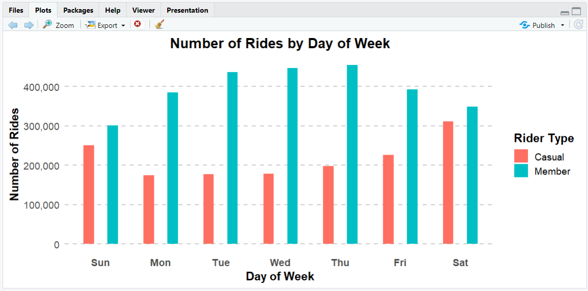
        - Figure 5 – Casual riders average nearly double the duration of members.

2. Average Ride Duration by Weekday:
   - Casual riders tend to have longer rides on weekends, especially Saturday and Sunday.
   - Members maintain steady, shorter average ride durations throughout the week.
     → This reflects a clear difference in ride intent: leisure vs. routine commuting.

        <pre><code class="language-r">
        ggplot(weekday_summary, aes(x = day_of_week, y = average_duration, fill = member_casual)) +
          geom_col(position = position_dodge(width = 0.8), width = 0.35) +
          scale_fill_manual(values = c("casual" = "#FF6F61", "member" = "#00BFC4"),
                            labels = c("Casual", "Member")) +
          labs(
            title = "Average Ride Duration by Day of Week",
            x = "Day of Week",
            y = "Avg. Duration (mins)",
            fill = "Rider Type"
          ) +
          theme_minimal(base_size = 14) +
          theme(
            plot.title = element_text(face = "bold", hjust = 0.5, size = 16),
            axis.title.x = element_text(face = "bold"),
            axis.title.y = element_text(face = "bold"),
            axis.text.x = element_text(face = "bold"),
            legend.title = element_text(face = "bold"),
            legend.position = "right",
            panel.grid.major.y = element_line(color = "gray80", linetype = "dashed"),
            panel.grid.minor.y = element_blank(),
            panel.grid.major.x = element_blank()
          )
        </code></pre>
        
     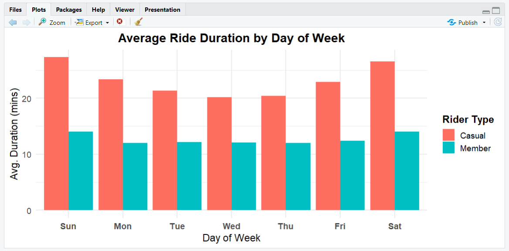
        - Figure 6 – Casuals ride more on weekends; members ride more on weekdays.

3. Average Ride Duration by Rider Type:
   - Casual riders take rides that average approximately 23.6 minutes.
   - Members ride for about 12.6 minutes.
      → This suggests that members are likely using bikes for utility-based purposes such as commuting, while casual riders use them more for leisure or recreation.
     
                <pre><code class="language-r">
        library(tidyverse)
        library(lubridate)
        library(janitor)
        
        # Import and clean all ride data
        file_list &lt;- list.files("data_raw", pattern = "*.csv", full.names = TRUE)
        
        all_trips &lt;- file_list %&gt;%
          map_df(read_csv) %&gt;%
          clean_names() %&gt;%
          mutate(
            started_at = ymd_hms(started_at),
            ended_at = ymd_hms(ended_at),
            ride_length = as.numeric(difftime(ended_at, started_at, units = "mins")),
            day_of_week = wday(started_at, label = TRUE)
          ) %&gt;%
          filter(ride_length > 1, !is.na(member_casual)) %&gt;%
          drop_na()
        
        # Calculate average ride duration by rider type
        summary_stats &lt;- all_trips %&gt;%
          group_by(member_casual) %&gt;%
          summarise(
            average_ride_length = mean(ride_length),
            .groups = "drop"
          ) %&gt;%
          mutate(member_casual = factor(member_casual,
                                        levels = c("casual", "member"),
                                        labels = c("Casual", "Member")))
        
        # Plot average ride duration with values displayed on top
        ggplot(summary_stats, aes(x = member_casual, y = average_ride_length, fill = member_casual)) +
          geom_col(width = 0.6) +
          geom_text(aes(label = round(average_ride_length, 1)),
                    vjust = -0.6, size = 5, fontface = "bold") +
          scale_fill_manual(values = c("Casual" = "#FF6F61", "Member" = "#00BFC4")) +
          labs(
            title = "Average Ride Duration by Rider Type",
            x = "Rider Type",
            y = "Avg. Duration (mins)",
            fill = "Rider Type"
          ) +
          theme_minimal(base_size = 14) +
          theme(
            plot.title = element_text(hjust = 0.5, face = "bold", size = 16),
            axis.title.x = element_text(face = "bold"),
            axis.title.y = element_text(face = "bold"),
            axis.text.x = element_text(face = "bold"),
            legend.title = element_text(face = "bold"),
            legend.position = "right",
            panel.grid.major.x = element_blank(),
            panel.grid.minor = element_blank()
          ) +
          ylim(0, 30)
        </code></pre>

        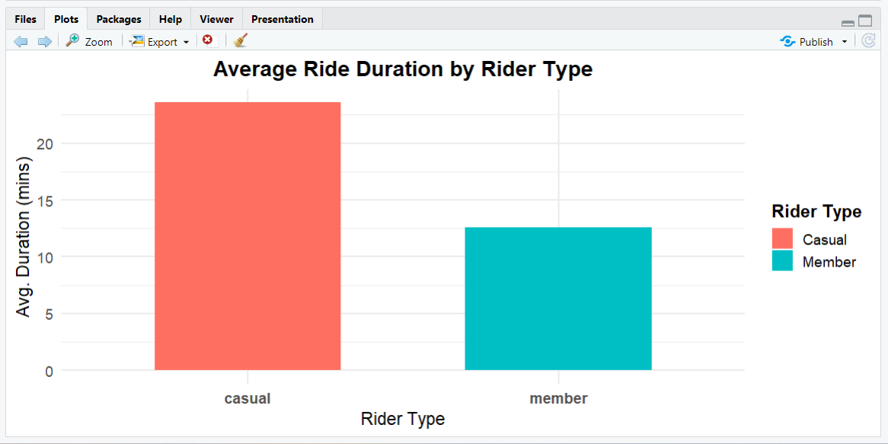
        - Figure 7 – Casuals ride longer, especially on weekends.

**Recommendations:**

- Weekend Promotions for Casual Riders 
Launch discounted weekend passes or referral codes to convert casuals who already ride on weekends.

- Commuter-Focused Messaging for Member 
Emphasize convenience, predictability, and cost-saving benefits of membership for daily work travel.

- In-App Membership Nudges 
Trigger smart prompts for casual users who frequently ride (e.g., “You’ve taken 3 rides this week — save with a membership”).

**Contribution and Licensing:**

This project was developed for educational purposes through the Google Data Analytics Professional Certificate. All data used is publicly available and anonymized, provided by Motivate International Inc. under open license terms.

---

### Project 6: Bellabeat Smart Device Usage Analysis for Strategic Marketing

### (May 2026, Google Data Analytics Capstone Project - Case Study #2)

**Project Overview:**
This project focused on analyzing smart device usage trends using public Fitbit data to support strategic growth for Bellabeat, a wellness technology company. The goal was to uncover patterns in user behavior (e.g., sleep, activity, heart rate) and translate those insights into marketing strategies for Bellabeat’s wellness products. The analysis focused on user habits across Bellabeat's target demographics, especially around activity and sleep, and culminated in actionable recommendations to optimize product engagement and customer acquisition.

**Technical Specifications:**

Software Used: R (RStudio), Google Sheets, Tableau, GitHub

**Techniques Applied:**

- Data Exploration: Explored and summarized activity, steps, sleep, and calories data from Fitbit users using summary statistics and visualizations.

- Data Cleaning: Addressed missing values, removed duplicates, standardized column names, and validated data types and formats in R.

- Behavioral Analysis: Identified weekday/weekend differences, activity trends by hour, and sleep duration ranges linked to calorie burn and activity levels.

- Visualization and Storytelling: Built clear visuals using ggplot2 and Tableau to show usage trends and generate insights on how Bellabeat could better align with consumer wellness habits.

**Project Components and Methodology:**

**Project Structure:**

Raw Data Import and Initial Review - 
   
Objective: Understand the format and quality of the public Fitbit dataset from Kaggle
    
Methodology: 

- Imported .csv files into R

- Inspected tables: dailyActivity, dailyCalories, dailySteps, sleepDay, and heartrate_seconds

- Conducted initial checks for NULLs, unusual values, and formatting issues
  

Cleaning and Transformation Module - 

Objective: Prepare the data for analysis across multiple domains (activity, sleep, heart rate)
    
Methodology: 

- Merged and joined key tables (e.g., sleepDay + dailyActivity)

- Removed duplicate rows and filtered out erroneous entries (e.g., sleep duration = 0, extreme calories)

- Standardized date formats and derived new fields (e.g., total minutes asleep, active minutes, day of week)
  

Analysis Module - 

Objective: Extract trends to inform Bellabeat’s marketing direction

Methodology: 

- Analyzed activity and calorie patterns by weekday and user

- Explored relationship between sleep and calorie burn

- Identified low-engagement patterns that could be addressed via app nudges or coaching

- Visualized hourly activity trends to inform content scheduling for Bellabeat app notifications
  

Key Findings:

- Sleep Duration: Users with 7–8 hours of sleep burned more calories and had more active minutes on average

- Activity Patterns: Peak steps and calories burned occurred mid-week (Tuesday–Thursday), with reduced engagement on weekends

- Inactive Users: Some users displayed very low step counts or no recorded sleep data, indicating opportunities for re-engagement

- Calorie Burn: Consistently higher calorie burn correlated with longer active minutes, especially among users who walked over 10,000 steps

        
**Usage Instructions**

System Requirements:

- Software: R/RStudio, Google Sheets (optional), Tableau (for visualization)

- Hardware: Standard workstation capable of running R and processing moderate datasets (~1M rows)

Installation and Running Instructions:

1. Download the Fitbit dataset from Kaggle
   
2. Use bellabeat_analysis.R to import, clean, and analyze the dataset
  
3. Review the generated .csv summaries and Bellabeat_Insights.pdf report
  
4. Open Tableau file or visual gallery for presentation-ready charts

   

**Testing and Debugging:**

- Validated merged dataframes for row consistency and ID overlap

- Ensured accurate transformation of datetime formats and numeric summaries

- Verified logical relationships (e.g., active calories vs. steps, sleep hours vs. calorie burn)

- Explored outliers to determine inclusion/exclusion based on real-world plausibility

  

**Contribution and Licensing:**

This project was created for educational use as part of the Google Data Analytics Certificate. Data was sourced publicly from Fitbit (via Kaggle) and anonymized under a CC0 public domain license.

Future Enhancements and Feedback:

1. Expand Scope: Add smartwatch behavioral data from other sources for broader trend comparison

2. Real-Time Integration: Connect live Bellabeat data streams for interactive dashboards

3. User Segmentation: Cluster users by behavior types to support persona-based marketing

4. Personalized Recommendations: Build logic for app nudges or habit-based notifications based on engagement trends

